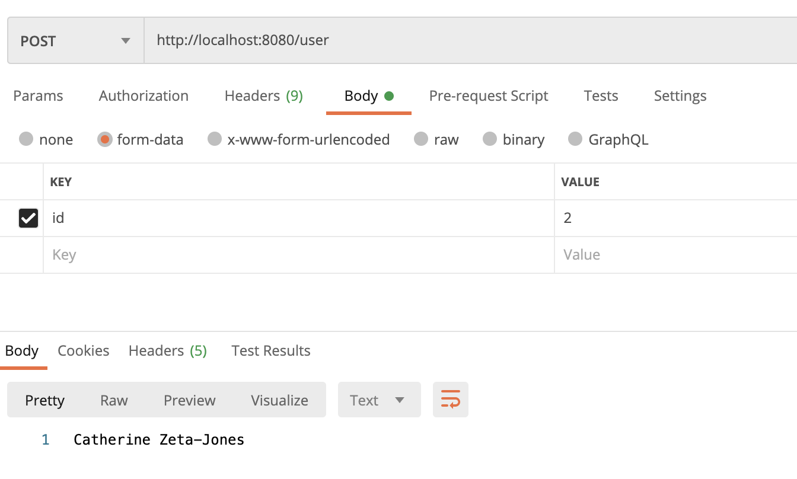

"Тестовое задание: REST API (Middle Java Developer, Конкорд банк)
 
 Необходимо реализовать REST API на Java, позволяющее отправить на него http POST запрос и получить ответ. 
 
 Требования:
 1. Запрос и ответ в формате JSON.
 2. Запрос, ответ и дату/время необходимо залогировать в отдельный файл.
 3. Проект должен собираться в war, для установки на Tomcat.
 4. Если в запросе содержится поле "id" со значением = 1, то ответ должен быть по примеру ниже, иначе ответ должен быть NULL.
 5. Формат запроса POST.
 6. Реализовать шифрование и дешифрование AES-256 входящего запроса и ответа. Эту часть необходимо только залогировать. Например (часть лога):
 === encryption: sfdjnva9sfv87say9hdfow3
 === decryption: {"fio": "Test Testov"}
 
 Пример запроса BODY:
 {"id": 1}
 
 Пример ответа BODY:
 {"fio": "Test Testov"}
 
 Рекомендуется использовать Maven, Spring (Rest Controller), Log4j. Остальное на усмотрение разработчика. Желательно выполнить максимальное количество требований :)"
 
 ===========================
 
 В качестве БД принял решения использовать Н2 в режиме in-memory, поскольку её не надо дополнительн устанавливать, то есть, БД существует, пока существует приложение
 
 # Запрос на действительный ID:
 

 # Запрос на несуществующий ID:
 

# Файл логирования:

Шифрование реализовано таким образом, что каждый раз шифр получается уникальным

